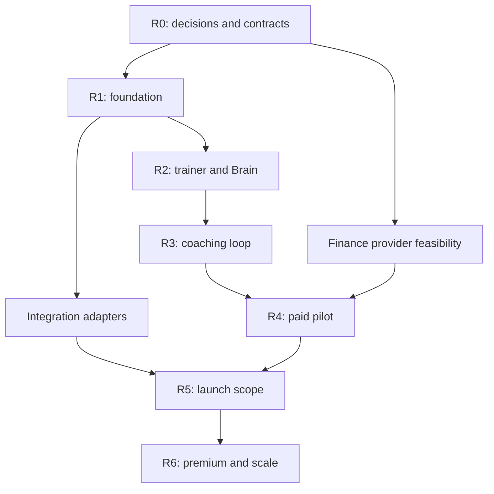

# Delivery roadmap

Status: implementation underway, 24 September 2026. See [build status](BUILD_STATUS.md) for observed evidence and remaining work. Issue IDs and dependencies extend the [implementation plan](../IMPLEMENTATION_PLAN.md); they are issue-ready work packages, not completed work or existing GitHub issues. Each row can split into small implementation tasks while retaining its parent ID and evidence.

## 1. Release sequence

| Release | Deliverable | Completion evidence |
| --- | --- | --- |
| R0 — Feasibility and contracts | Approved funds-flow design, provider capability register, region/privacy decision queue, schema/events, budgets | Written decisions and sandbox traces where access exists; unsupported steps explicitly blocked |
| R1 — Foundation | Two isolated tenants, authentication, design system, CI, staging, events, provisioning | Cross-tenant probes fail; staging deploy and recovery smoke pass; signup persists |
| R2 — Trainer activation | Public funnel, resumable onboarding, ingestion, Constitution, scenarios, preview | Trainer can teach, review, correct and resume their Brain using real stored data |
| R3 — Coaching | Brain evaluation/release, Client Twin, programs, workout PWA, chat, takeover | One complete trainer-to-subscriber coaching journey; safety and provenance gates pass |
| R4 — Controlled paid pilot | Stripe lifecycle, Lean beneficiaries/payouts, ledger, fees, refunds, monthly close | Sandbox finance suite and approved live canary reconcile to bank evidence |
| R5 — Complete launch scope | Wearables/imports, domains, bookings, lifecycle messaging, full administration | Each enabled feature passes its source-spec acceptance; unavailable providers remain honestly flagged |
| R6 — Premium and scale | Voice, native companion where approved, guarded infra automation, operational hardening | Rights/consent, measured cost/latency, rollback/restore and operator handoff |

### Nutrition extension — 25 September 2026

The owner confirmed **workout only** and higher-priced **workout + nutrition** subscriptions. The [nutrition integration plan](NUTRITION_INTEGRATION_PLAN.md) adds internal work IDs **035–044** for entitlements, case-based coach teaching, intake/consent, recipes/calculations, connected weekly plans/daily meals/cooking/portions/groceries, nutrition Brain/Twin, exception handling and release evidence. Core 035–042 is implemented in development and 044 release verification is in progress; optional provider work 043 remains unconfigured. The original 001–034 baseline remains intact and these IDs are not created GitHub issues. Conditional onboarding learns what the coach recommends for realistic cases and verifies scope/coverage on held-out cases. Qualified routine outputs are delivered automatically; the coach handles exceptions rather than approving every plan. Manual food/recipe workflows are the foundation, not the complete product. The core release includes automatic nutrition delivery; optional food/photo integrations follow. Clinical scope and provider rights remain reviewed inputs.

### Dependency map

This graph identifies independent work, not permission to spawn agents. Payment-provider delays do not prevent local foundation, Brain or coaching work; they block live commerce. Residency uncertainty blocks sensitive production data, not synthetic test fixtures.

## 2. Work packages and acceptance

The original baseline started all 34 as **NOT STARTED**. Current work is recorded in [build status](BUILD_STATUS.md); no entire release is marked production-verified. Owner means a responsibility, not a staffed appointment. Evidence must identify the tested commit, environment, fixture and result. A provider access limitation remains a blocker rather than a passed check.

| ID | Owner | Concrete output | Acceptance evidence |
| --- | --- | --- | --- |
| 001 | Finance/backend | Stripe collection/settlement and Lean source-bank/beneficiary/payout capability report | Subscription, settlement and payout references; individual/business cases; authorization, unknown outcome and final-state behavior documented |
| 002 | Finance/product | Funds-flow ADR and merchant/platform/trainer responsibilities | Approved sale/settlement model; tax, fees, reserves, cutoff and mixed-price commission examples; unresolved matters named |
| 003 | Platform/privacy | Region and sensitive-data placement decision | UAE latency measurement and reviewed data map; approved cross-border path or separate sensitive-data plane |
| 004 | Operator/platform | Budget, credential and release-authority register | Test/live scope, owner and readiness for each dependency; approved spend caps and payout authority recorded without secrets |
| 005 | Platform | Workspace, CI, container builds, IaC, local/staging setup, secrets wiring | Clean checkout builds; staging health check; separate environment identity; backward-compatible migration and rollback smoke |
| 006 | Backend | Auth, roles/MFA, tenant provisioning, verified hostname resolver | Signup/retry provisions one tenant; invite/revoke and session expiry work; host/session mismatch denied |
| 007 | Backend | Domain schema, RLS, cache/object/vector/job boundaries | Two tenants cannot read/write one another's data, files, embeddings or jobs; privileged access uses separate audited path |
| 008 | Backend | Events, inbox/outbox, jobs, consent, provider contracts, feature flags | Crash/replay produces one logical effect; consent version persists; disabled integration cannot be called from UI or API |
| 009 | Frontend/design | Accessible tokens, layout shells, shared controls and state components | Representative desktop/iPhone/Android views; keyboard/focus/contrast checks; trainer theme cannot break readability |
| 010 | Growth/frontend | Acquisition site, interactive Brain demo/calculator, attribution | Every CTA reaches a working next step; fee examples correct; first/last source survives signup and first payment |
| 011 | Product/full stack | Resumable onboarding framework, identity/brand/storefront draft and persisted registry for all 16 steps; later capabilities arrive with their owning issues | Cross-device resume; server saves; actionable provisioning errors; unavailable steps show their actual dependency; Brain setup remains independent of deferred licence upload |
| 012 | Backend/AI | File intake, extraction, provenance/rights and review queue | Supported file fixtures processed; unsafe files rejected; duplicates do not bill/process twice; third-party personal data flagged |
| 013 | AI/product | Adaptive interview, confirmed Constitution, rule conflicts and scenario lab | Trainer approves/rejects rules; unresolved conflicts cannot silently enter production; corrections retain structured diff and reason |
| 014 | AI | Versioned Brain releases, held-out evaluation and shadow/supervised modes | Evaluation set isolated from learning; approval/CAS promotion and rollback; every decision resolves the pinned release |
| 015 | Backend | Intake, consent, versioned Client Twin and source lineage | Unknown/denied/missing distinguished; stale data marked; subscriber can inspect/correct appropriate facts |
| 016 | AI/backend | Structured Coach Runtime, safety governor and model gateway | Decision persisted before prose; rights enforcement cannot be bypassed by prompts; unsafe/uncertain output escalates |
| 017 | Full stack | Programs, exercise library, offline workouts, chat and exception takeover | Workout survives disconnect/replay; pain interrupts; human takeover stops automatic replies; evidence-backed program changes |
| 018 | Finance/backend | Stripe products/Checkout/subscriptions and entitlement projection | Signed payment events drive access; renew/fail/grace/change/cancel/reactivate scenarios; return URL cannot fake payment |
| 019 | Finance/backend | Lean company-bank configuration and trainer beneficiary workflow | IBAN format + ownership/identity checks; asynchronous verification; bank-change re-auth/hold; masked status only in ordinary UI |
| 020 | Finance/backend | Balanced ledger, fee schedules, AI usage ledger and reconciliation | Independent fee calculations; charge/fee/refund/payout source mapping; Stripe, Lean and bank differences produce exceptions |
| 021 | Finance/full stack | Self-service cancellation, seven-day refund queue, disputes/overrides | Renewal stops at paid-period end; refund stays separate; trainer approval/decline and audited admin override; post-payout adjustment |
| 022 | Finance/backend | Monthly close, dry run, Lean execution and recovery | Same liabilities cannot be paid twice across retries/revisions; unknown remains pending; confirmed failure and return recover correctly |
| 023 | Privacy/product | Legal versions, consent, age/safety gates, export/deletion and incident flow | Reviewed live documents; scope-specific consent; deletion reaches derived data/providers as required; lawful finance retention preserved |
| 024 | QA/full stack | End-to-end trainer → subscriber → coaching → finance scenarios | One trace ties onboarding, Brain, charge, workout, cancellation/refund and payout to the same tenant; separate failure scenarios |
| 025 | Platform/QA | Security, accessibility, performance, restore, canary and on-call readiness | Release evidence bundle; tested operator alerts; restoration/rollback within demonstrated targets; no unresolved critical exposure |
| 026 | Integrations | WHOOP OAuth/webhook/reconciliation and rights controls | Refresh/revoke/dedupe/staleness; approved deterministic path; restricted AI uses blocked; production approval evidence |
| 027 | Integrations | Apple export import and approved Zepp adapter/import fallback | Category/date coverage visible; duplicate/partial import and deletion correct; unsupported Zepp access clearly disabled |
| 028 | Platform/full stack | Custom domain quote/payment/purchase/DNS/TLS/renewal orchestration | Exact-price confirmation; no duplicate purchase; uncertain result reconciles; subdomain still works on failure |
| 029 | Voice/AI | Consent/identity verification, Session Director, audio controls, cost and fallback | Consent race/revocation enforced; 30–45 minute test; interruption and provider outage fall back; usage matches billable units |
| 030 | Product/full stack | Bookings, transactional lifecycle messages, conversion experiments and affiliate policy | Concurrent booking cannot oversell; timezone/cancel/no-show rules; deduped messages and opt-outs; experiment guardrails |
| 031 | Full stack/data | All trainer/admin/support views, cohorts, finance and FinOps drill-down | Dashboard aggregates reconcile to sources; scope-aware support; audited time-limited impersonation; health data excluded from growth targeting |
| 032 | Platform | Infrastructure broker and Governor, initially observe-only | Denied action/cost scope cannot execute; approved reversible action is idempotent and rollback-tested; credentials never enter model context |
| 033 | Mobile/integrations | Native HealthKit/BLE companion and store-ready account flows | Partial permissions/background sync/revocation; honest live-vs-estimated physiology; store policy and review evidence before release |
| 034 | AI/finance | Optional bespoke-model decision, then pipeline only if justified | Measured baseline gap, rights-approved corpus, held-out uplift and positive cost case; otherwise retain provider-agnostic runtime |

## 3. First sprint: a concrete foundation

Use these as ordered deliverables, not a promised number of days. The aim is one deployable, persistent slice.

1. Record the current source revision and owner decisions. Open a decision register for provider readiness, residency, monetary policy and budget. Prepare contract/sandbox harnesses while credentials are pending; record untested cases.
2. Initialize TypeScript workspace (npm selected in ADR 001) with web, API and worker apps; shared contracts, domain, database and UI packages; pinned toolchain, lockfile and setup README.
3. Implement the first migration: users, tenants, memberships/roles, onboarding state, domains, consent, event/outbox and job tables. Add two synthetic tenants and adversarial isolation fixtures.
4. Implement identity and tenant bootstrap: retry-safe account-to-tenant creation, slug reservation, session/host binding, persisted identity/brand onboarding steps and platform error references.
5. Build the warm-white, ink/navy responsive shells and common loading/empty/error/denied states. Demonstrate signup → saved brand draft → sign out → resume.
6. Establish CI and the smallest approved staging footprint, health checks, structured logs, one alert, migration/rollback instructions and a deploy record. If infrastructure access is pending, deliver a reproducible local setup and keep staging status explicitly blocked.
7. Review the isolation, tenancy and provider contracts once with Astra. Fix concrete findings, commit the slice and update project memory. Start ingestion only when these foundations pass.

**Sprint exit:** another engineer can start from a clean checkout, run the documented checks and reproduce the saved tenant journey; a second tenant cannot access it. A screenshot alone is insufficient evidence.

## 4. Pilot and expansion

Proposed initial cohort: 3–5 consenting trainers and at most 50 subscribers, subject to operational capacity and approved live-payment authority. Include representative beginner/experienced coaching, incomplete data, an eligible personal-IBAN trainer and an eligible business-IBAN trainer. Test sensitive/unsafe conditions with synthetic cases, not induced real incidents.

Before the first live subscriber, complete the enabled product path, provider/legal/residency requirements, support ownership and dry-run finance evidence. Observe at least one complete monthly payout close and reconciliation before broad expansion. Expansion additionally requires stable safety/tenant isolation, actionable support queues, acceptable measured unit costs and a tested recovery path. Business targets remain targets; publish measured cohort outcomes with sample size and period.

## 5. Scope and progress control

Track each work package as `NOT_STARTED → IN_PROGRESS → IN_REVIEW → VERIFIED`, with `BLOCKED` carrying an owner and next action. Feature, test and deployment statuses are separate. Mark production-ready only after the release gate in [operations](OPERATIONS_AND_RELEASE.md).

For each implemented task record: relevant source sections and screen IDs; changed contracts/migrations; behavior and failure states; checks and results; staging URL/commit; flags; operational impact; unresolved dependency. Create GitHub issues when implementation starts without copying the entire specification into every issue. Use the source/coverage links and a short task-specific context packet.
